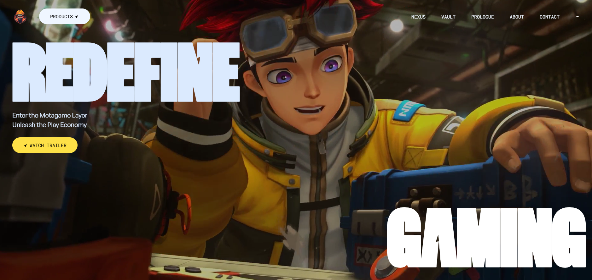

# ⚡ GSAP Animated Website

An interactive and visually rich website built using **React**, **GSAP (GreenSock Animation Platform)**, and **Vite**. This project showcases smooth animations, scroll-triggered effects, and a modern user interface — perfect for portfolios, creative landing pages, or storytelling sites.


---

## 🖼️ Preview
[](https://gsap-animated-website.netlify.app/)

## ✨ Features

- 🔄 Smooth animations powered by [GSAP](https://greensock.com/gsap/)
- 🎯 Scroll-triggered animations using GSAP ScrollTrigger
- ⚛️ Built with [React](https://react.dev/) + [Vite](https://vitejs.dev/)
- 📱 Responsive and mobile-friendly layout

## 🛠️ Tech Stack

- **Frontend**: React, Vite, Tailwind CSS
- **Animations**: GSAP + ScrollTrigger
- **Tooling**: ESLint, Prettier


## 🚀 Getting Started

Clone the repo and run locally:

```bash
git clone https://github.com/SHRAVANIRANE/gsap-animated-website.git
cd gsap-animated-website
npm install
npm run dev
```
The site will open at http://localhost:5173

## 📌 Project Status
<pre>
 Setup with Vite + React
 Navbar with basic animation
 Hero section animation
 ScrollReveal sections
 Bento Cards with animations
 Footer design
 Responsive layout
</pre>

# 🤝 Contributing
Pull requests are welcome. For major changes, please open an issue first to discuss what you’d like to change or improve.

# 💬 Let's Connect
For questions, suggestions, or collaboration, feel free to reach out:
📧 raneshravani21@gmail.com
